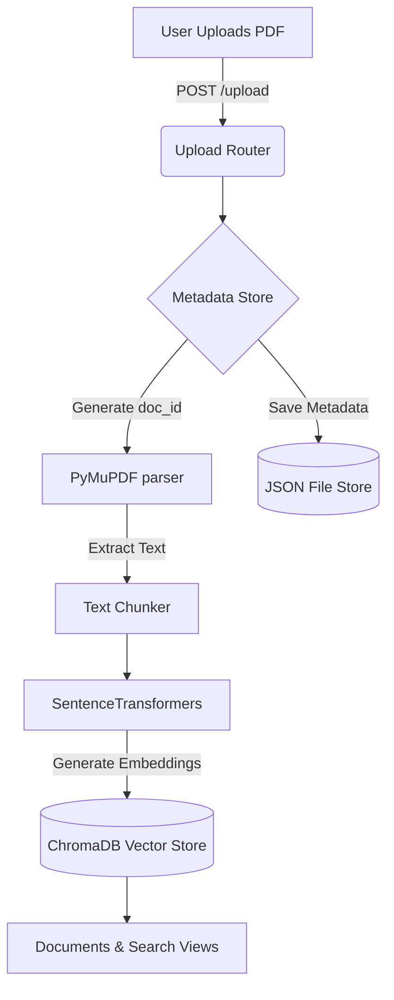
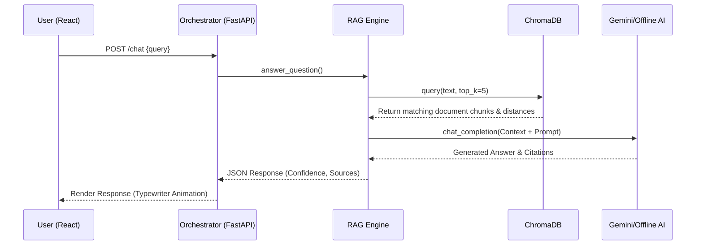

<div align="center">
  
# 🌌 AI-KOS 
### Enterprise Knowledge Assistant & Neural Copilot

[](https://reactjs.org/)
[](https://fastapi.tiangolo.com/)
[](https://www.trychroma.com/)
[](https://deepmind.google/technologies/gemini/)
[](https://tailwindcss.com/)

*A highly aesthetic, next-generation enterprise RAG (Retrieval-Augmented Generation) system.*

</div>

---

## 🌟 Overview

**AI-KOS** is a high-performance Enterprise Knowledge Assistant built to ingest, organize, and semantically query large-scale document repositories. Designed with a stunning **cyberpunk and glassmorphic aesthetic**, AI-KOS combines a dynamic, animated UI with a powerful Python backend to deliver instant, intelligent answers based entirely on your proprietary data.

Whether you are performing semantic fuzzy searches across thousands of documents, generating side-by-side vector comparisons, or chatting with the AI Copilot to extract citations from complex PDFs, AI-KOS handles it all seamlessly.

---

## 🎨 Professional Design & UI
The frontend is engineered to provide a "wow" factor upon first glance:
- **Glassmorphism:** Deep translucent cards with vibrant, blurred neon backgrounds.
- **Dynamic Animations:** Real-time pulse rings, hovering 3D data cubes, and typewriter streaming effects.
- **Micro-Interactions:** Custom hover states, glowing borders, and particle backgrounds designed using Framer Motion and raw CSS.

---

## 🚀 Core Features

1. 📊 **Dashboard (Command Center)**: Real-time telemetry, vector capacity, active neural queries, and system health monitoring.
2. 🗃️ **Knowledge Base**: Central repository for all ingested documents (PDFs, DOCX) dynamically categorized with semantic similarity scores.
3. 🔍 **Semantic Search**: Hybrid Vector + BM25 search engine for real-time fuzzy matching across the entire database.
4. 🤖 **AI Copilot (Chat)**: A RAG-powered orchestrator. Securely retrieves contextual snippets from ChromaDB to answer complex queries, providing **exact source citations**. Features a smart offline-mode fallback.
5. ⚖️ **Document Compare**: Side-by-side analysis generating an Alignment Score using cosine similarity.
6. 📈 **Analytics**: Deep telemetry tracking query volumes and neural confidence trends.
7. ☁️ **Data Ingestion**: Secure dropzone for asynchronous background parsing and SentenceTransformer embedding.
8. ⚙️ **Control Panel**: Configure Cognitive Engines (GPT-4o, Claude 3, Gemini 1.5), Access Protocols, and Integrations.

---

## 🏗️ System Architecture & Data Flow

AI-KOS operates on a decoupled architecture, ensuring the UI remains blazing fast while heavy vector computations happen asynchronously in the background.

### 🌐 Overall System Architecture

```mermaid
graph LR
    subgraph Frontend (React/Vite)
        A[App.tsx - Routing] --> C[Dashboard]
        A --> D[Knowledge Base]
        A --> E[Semantic Search]
        A --> F[AI Copilot]
        
        C -.-> Z[apiService.js]
        D -.-> Z
        E -.-> Z
        F -.-> Z
    end

    subgraph Backend (FastAPI)
        Z -->|REST API| Router[FastAPI Routers]
        Router --> Orch[Agent Orchestrator]
        Router --> Ingest[Upload/Ingestion Pipeline]
    end

    subgraph Data Layer
        Orch <--> DB1[(ChromaDB Vector Store)]
        Ingest --> DB1
        Ingest --> DB2[(JSON Metadata Store)]
        Orch <--> DB2
    end
```

### 📥 Document Ingestion Flow

When a user uploads a new PDF or DOCX file to the knowledge base:



### 🧠 RAG Query Flow (AI Copilot)

The lifecycle of a question asked to the AI Copilot:



---

## 🛠️ Technology Stack

### Frontend
- **Framework:** React 18 (Vite)
- **Styling:** TailwindCSS, Vanilla CSS Modules
- **Animations:** Framer Motion, CSS Keyframes
- **Icons:** Lucide React

### Backend
- **Framework:** FastAPI (Python 3.11+)
- **Vector Database:** ChromaDB
- **Embeddings:** SentenceTransformers (`all-MiniLM-L6-v2`)
- **LLM Integration:** Google Gemini 1.5 Pro (via `google-genai`), DuckDuckGo Offline Fallback API
- **Document Parsing:** PyMuPDF, `docx2txt`

---

## ⚙️ Quick Start

### 1. Clone the Repository
```bash
git clone https://github.com/rshamith777-cpu/AI-KOS.git
cd AI-KOS
```

### 2. Start the Backend
```bash
cd backend
python -m venv .venv
source .venv/bin/activate  # On Windows: .\.venv\Scripts\Activate.ps1
pip install -r requirements.txt

# Create a .env file and add your API key (optional, falls back to offline mode)
echo "GEMINI_API_KEY=your_key_here" > .env

# Run the server
uvicorn main:app --reload --port 8000
```

### 3. Start the Frontend
```bash
cd frontend
npm install
npm run dev
```
Navigate to `http://localhost:5173` in your browser.

---
<div align="center">
<i>Built for the future of Enterprise AI.</i>
</div>
